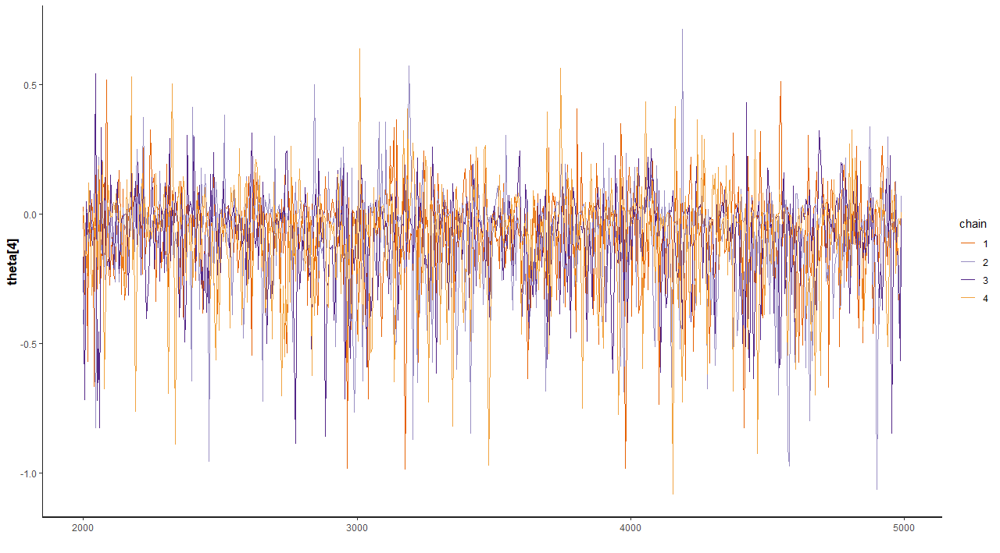
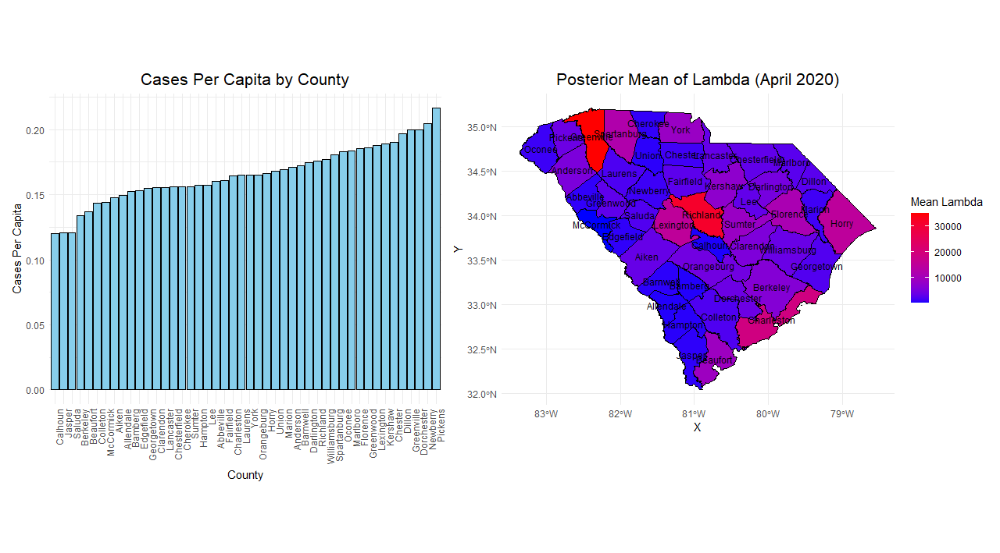
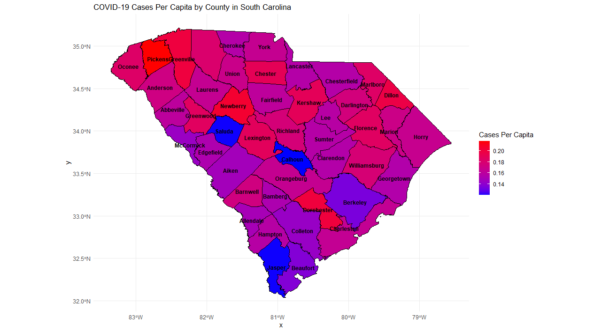

### Explanation of Trace Plots

Trace plots provide a visual assessment of how well the Markov Chain Monte Carlo (MCMC) sampling has converged and mixed for the parameters of interest. Each line in the trace plot represents a single MCMC chain, and the x-axis denotes the iteration number, while the y-axis shows the parameter's sampled value.

- **Beta, Sigma, and Rho Trace Plots**:  
  The trace plots for `beta_0`, `sigma`, and `rho` show the sampling behavior of these key parameters. Consistent patterns across chains suggest that the sampler has explored the posterior distribution effectively.

- **Theta Trace Plots**:  
  These plots visualize the sampling behavior of selected elements of the `theta` parameter vector (e.g., `theta[1]`, `theta[4]`, etc.). Well-mixed and stationary traces imply that the sampler is appropriately capturing the variability in these parameters.

### Boxplot of Posterior Theta Distributions by County
The plot below illustrates the posterior distributions of the parameter \(\theta\) for each county, derived from the fitted Bayesian model. \(\theta\) represents a county-specific characteristic, such as the likelihood of a certain event or an underlying risk factor. For this visualization:  
- Each boxplot corresponds to a specific county, with counties arranged on the vertical axis.
- The horizontal axis represents the range of posterior \(\theta\) values for each county.
- The boxplots provide insights into the variability and central tendency of \(\theta\) across posterior samples. Wider distributions indicate greater uncertainty in the estimate for that county, while narrower distributions suggest more precise estimates.  

This figure is useful for comparing the variability of \(\theta\) across counties and identifying counties with distinctly higher or lower values relative to others.

## Posterior Mean of Lambda Across Counties for April 2020

The next figure presents a map of South Carolina, showing the spatial distribution of the posterior mean of \(\lambda\) for April 2020.  
\(\lambda\) reflects a county-level parameter of interest, such as the average rate of an event or a model prediction.

Counties are shaded according to the mean \(\lambda\), with a gradient from blue (indicating lower values) to red (indicating higher values). Grey shading denotes counties for which \(\lambda\) estimates are unavailable.  
This map highlights geographical patterns in the parameter estimates. For example, clusters of high or low \(\lambda\) values may suggest spatial correlations or region-specific factors influencing the observed outcomes.

###Cases Per Capita Across Counties
The following map visualizes the distribution of reported cases per capita across counties for a specific time period. Cases per capita are calculated as the total number of cases in a county divided by its population, providing a standardized measure that accounts for differences in county population sizes.

Counties are shaded on a gradient scale, with lighter shades representing lower cases per capita and darker shades indicating higher values. This approach highlights regions with disproportionately high or low case rates relative to their population size.

This map helps identify hotspots of disease activity and regions with higher per capita risk. Such insights are valuable for resource allocation, public health interventions, and understanding local dynamics that may contribute to disease spread.

###Standard Error of Lambda Across Counties for April 2020
The final map visualizes the uncertainty associated with the 
\lambda estimates for April 2020, as measured by the posterior standard error.

Counties are shaded using a gradient from yellow (indicating lower uncertainty) to red (indicating higher uncertainty), with grey for counties with unavailable data.
This visualization helps identify regions where the model's predictions are less reliable, which could inform decisions about future data collection or model refinement.

